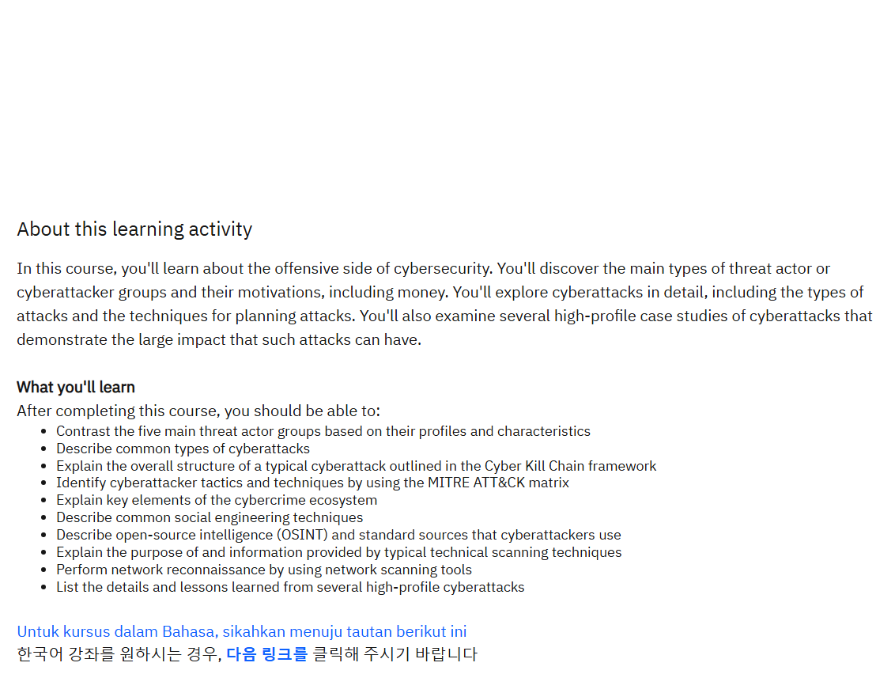
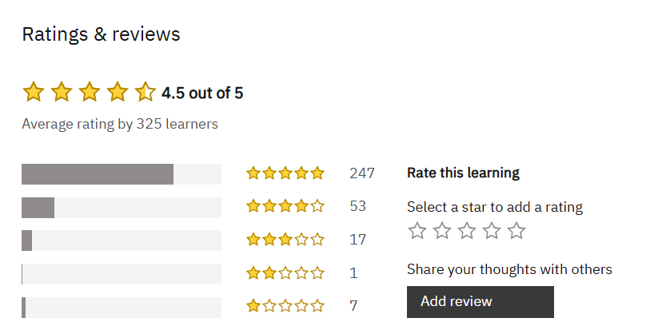

# 🛡️ IBM On the Offense – Cybersecurity Training  

This repository contains **notes, labs, playbooks, research case studies, and certificate of completion** for the *IBM On the Offense* cybersecurity program.  
The course focuses on understanding the attacker’s mindset, running Red vs Blue simulations, and building effective defense strategies.  

---

## 📚 Notes  

- 📄 [`01-introduction.md`](./notes/01-introduction.md) – Course overview  
- 📄 [`02-attackers-mindset.md`](./notes/02-attackers-mindset.md) – Thinking like an attacker  
- 📄 [`03-social-engineering.md`](./notes/03-social-engineering.md) – Social engineering tactics  
- 📄 [`04-red-vs-blue.md`](./notes/04-red-vs-blue.md) – Red vs Blue team simulation  
- 📄 [`05-defense-strategies.md`](./notes/05-defense-strategies.md) – Layered defense strategies  
- 📄 [`06-case-studies.md`](./notes/06-case-studies.md) – Lessons from real-world incidents  

---

## 🧪 Labs  

- 🔍 [`lab-incident-response.md`](./labs/lab-incident-response.md) – Handling a security incident  
- ✉️ [`lab-phishing-awareness.md`](./labs/lab-phishing-awareness.md) – Phishing awareness exercise  
- ⚔️ [`lab-red-vs-blue-simulation.md`](./labs/lab-red-vs-blue-simulation.md) – Simulated Red vs Blue engagement  

---

## 📋 Playbooks  

- ✅ [`detection-response.md`](./playbooks/detection-response.md) – Detection & response checklist  
- ✅ [`email-security.md`](./playbooks/email-security.md) – Email security guide  

---

## 🔬 Research  

- 📑 [`case-studies.md`](./research/case-studies.md) – Analyzed security incidents  
- ⚔️ [`real-world-exploits.md`](./research/real-world-exploits.md) – Offensive techniques & defenses  
- 📆 [`timeline.md`](./research/timeline.md) – Attack phases timeline  

---

## 📖 Docs  

- 📘 [`glossary.md`](./docs/glossary.md) – Terminology  
- 📘 [`overview.md`](./docs/overview.md) – Course outline  
- 📘 [`references.md`](./docs/references.md) – References & sources  
- 📘 [`roadmap.md`](./docs/roadmap.md) – Learning roadmap  
- 📘 [`syllabus.md`](./docs/syllabus.md) – Course syllabus  

---

## 📸 Screenshots  

| Step                  | Screenshot |
|-----------------------|------------|
| 🏫 About the Course   |  |
| ⭐ Course Rating      |  |

---

## 📜 Certificate  

🎓 [`IBM On the Offense`](./cert/IBM%20On%20the%20Offense.png)  

---

## 📝 Personal Review  

This course was an excellent introduction to **thinking like an attacker** while simultaneously learning how to **defend as a blue teamer**.  
I found the **Red vs Blue simulation lab** particularly engaging, as it provided a hands-on perspective on offensive vs defensive operations.  
The **social engineering module** highlighted the importance of human factors in cybersecurity, a reminder that technology alone is never enough.  

Overall, I would recommend this program to anyone wanting a **balanced approach to offensive & defensive security**.  

---

## ✍️ Author  

**Thành Danh** – Red Team Learner & Security Researcher  

- GitHub: [@ngvuthdanhh](https://github.com/ngvuthdanhh)  

- Email: ngvu.thdanh@gmail.com   

---

## 📄 License  

This project is licensed under the terms of the **MIT License**.  
See [`LICENSE`](./LICENSE) for full details.  

© 2025 ngvuthdanhh. All rights reserved.  
